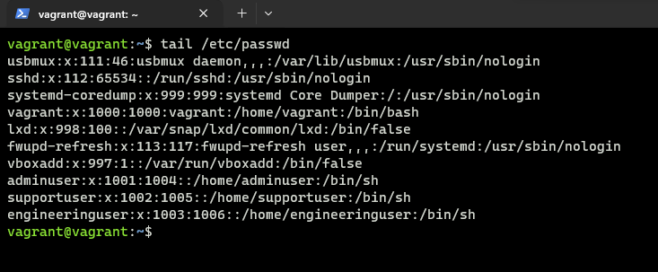
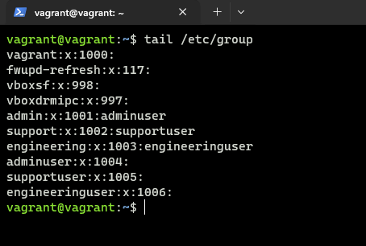
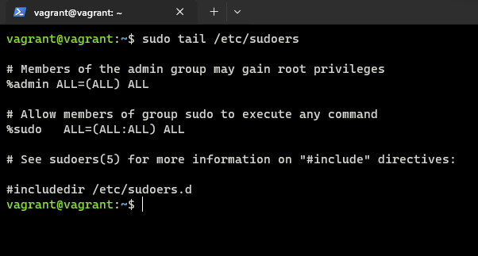
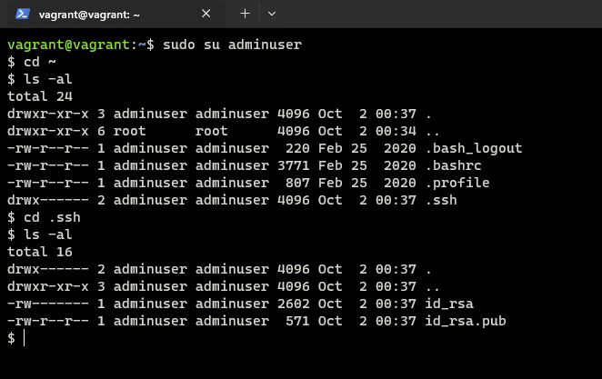

# Submit the contents of the /etc/passwd, /etc/group, and etc/sudoers

## 1. Content of the /etc/passwd

## 2. Content of the /etc/group

## 3. Content of the /etc/sudoers

## 4. ssh keys for the user in the admin group

